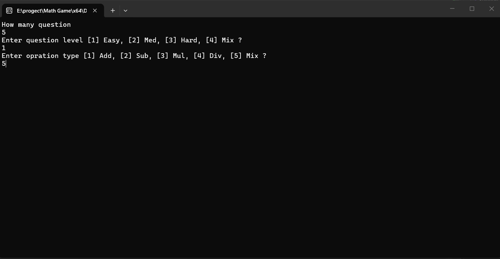
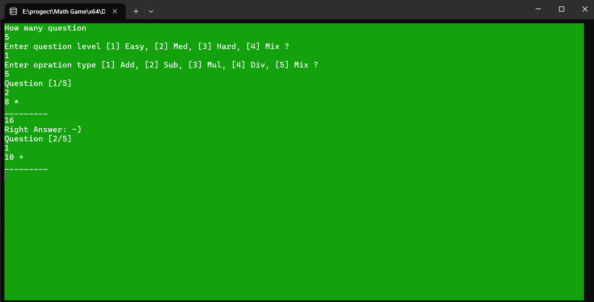
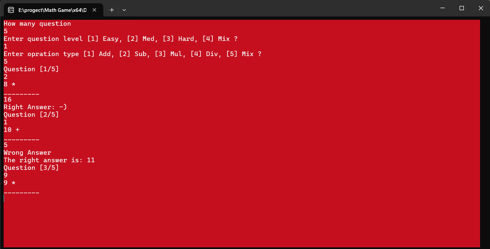
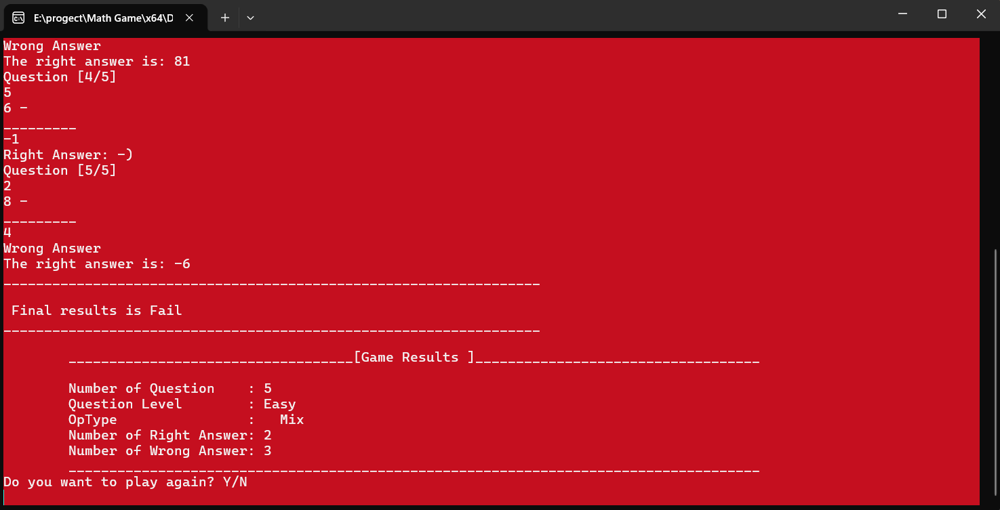

# Math Game

A console-based Math Game developed using C++.

The program generates mathematical questions based on the selected
difficulty level and operation type. The player answers each question,
and the program tracks the correct and wrong answers before displaying
the final game results.

---

## Features

- Choose the number of questions.
- Choose the question difficulty:
  - Easy
  - Medium
  - Hard
  - Mix
- Choose the operation type:
  - Addition
  - Subtraction
  - Multiplication
  - Division
  - Mix
- Randomly generated mathematical questions.
- Tracks correct and wrong answers.
- Displays the final game results.
- Changes the console color based on the answer/result.
- Allows the player to play again.

---

## Technologies

- C++
- Visual Studio
- Git
- GitHub

---

## Project Structure

```text
Math-Game/
│
├── Math Game/
│   ├── Math Game.cpp
│   ├── functions.cpp
│   └── functions.h
│
├── screenshots/
│   ├── game-start.png
│   ├── question.png
│   └── results.png
│
├── .gitignore
├── Math Game.sln
└── README.md
```

---

## Screenshots

### Game Start



### Question





### Final Results


